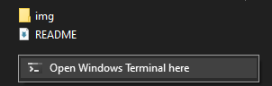

# Windows Terminal Context Menu

## A simple guide to add `open with terminal` option to context menu 

#

## Instalation

### Download .reg file, change paths to correct ones and double click it.
### See explanation below to understand what each line does:

#

### Open Windows Terminal within a folder

Registry file explained:

Text that will appear in context menu\
`@="Open Windows Terminal here"`

Optional icon, for example\
`"Icon"="%USERPROFILE%\\AppData\\Local\\terminal\\terminal.ico"`

Path to your wt.exe, example path for Windows Store. Change USER to your username\
`@="C:\\Users\\!USER!\\AppData\\Local\\Microsoft\\WindowsApps\\wt.exe --startingDirectory %V"`

#

### Open Windows Terminal in selected folder

TODO

#

### Icon

Icon is taken from official Windows Terminal repository, published under Creative Commons Attribution-NoDerivatives 4.0 license

Icon - [Direct link](https://github.com/microsoft/terminal/blob/master/res/terminal.ico)

Windows Terminal repository - [Direct link](https://github.com/microsoft/terminal)